# Demo runbook: Chest X-ray Triage on Cloudera AI

Part 1 is the one-time setup, copy-paste, in order. Part 2 is the seven-minute
demo. Part 3 is the failure-path rehearsal, the VERIFY list and troubleshooting.

## Part 1: setup (one-time)

### 1.1 Prerequisites

| Need | Detail |
|---|---|
| Workbench | Cloudera AI Workbench with Jobs, Models, Applications and Experiments; AI Registry optional |
| Runtime | JupyterLab, Python 3.11, Standard edition. GPU optional (feature build only) |
| Resources | 4 vCPU / 16 GB for the feature build; ~8 GB project storage |
| Outbound | pypi.org, download.pytorch.org, huggingface.co (or internal mirrors), github.com, kaggle.com |
| Accounts | GitHub repo `partomia/Chest-X-ray-Triage`; a Kaggle account for the dataset |

### 1.2 Project, packages, environment

1. Projects > New Project > Git: `https://github.com/partomia/Chest-X-ray-Triage`
   (SSH URL for a private repo, after adding the CAI user's SSH key as a
   read-only deploy key). Runtime: JupyterLab, Python 3.11, Standard.

   

2. Project Settings > Advanced > Environment variables:

   | Variable | Value |
   |---|---|
   | `HF_HOME` | `/home/cdsw/.hf_cache` |
   | `HF_TOKEN` | optional: a Hugging Face read token, avoids rate limits on the ViT download |
   | `HF_ENDPOINT` | only for an internal Hugging Face mirror |

   

3. Open a session (4 vCPU / 16 GB) and install:

   ```bash
   pip3 install -r requirements.txt
   ```

   torch and torchvision come from the CPU wheel index (`download.pytorch.org/whl/cpu`).
   A yellow "dependency resolver" warning at the end is harmless; only an `ERROR:` line matters.

   

### 1.3 Data

Kaggle now issues API tokens (`KGAT_...`) instead of a `kaggle.json` download;
the Kaggle CLI 1.8+ reads them from `KAGGLE_API_TOKEN`. Revoke the token once
the download is done.

```bash
pip3 install -U kaggle         # 2.x; needs >= 1.8 for KGAT_ tokens
export KAGGLE_API_TOKEN=<token from kaggle.com > Settings > API>
kaggle datasets download -d paultimothymooney/chest-xray-pneumonia -p data/raw
cd data/raw && unzip -q chest-xray-pneumonia.zip && rm chest-xray-pneumonia.zip && cd /home/cdsw
rm -rf data/raw/chest_xray/chest_xray data/raw/chest_xray/__MACOSX data/raw/__MACOSX   # nested copy in the zip
ls data/raw/chest_xray          # must be train  val  test
mkdir -p data/incoming
ls data/raw/chest_xray/test/PNEUMONIA/*.jpeg | head -25 | xargs -I{} cp {} data/incoming/
ls data/raw/chest_xray/test/NORMAL/*.jpeg    | head -15 | xargs -I{} cp {} data/incoming/
for s in train val test; do echo "$s: $(find data/raw/chest_xray/$s -name '*.jpeg' | wc -l)"; done
unset KAGGLE_API_TOKEN
```

The zip is 2.29 GB (it holds a second, nested copy); after the clean-up
`data/raw` is 1.2 GB. Expect 5,216 train, 16 val and 624 test films (5,856 in
total) and 40 in `data/incoming`. Kaggle lists the licence as "other": check the
attribution (Mendeley release, CC BY 4.0) before showing it to a customer.

### 1.4 Smoke test, then baseline

```bash
python features/build_feature_table.py --limit 20     # ~1 min incl. the ViT download
python train/train_validate.py
python gate/kpi_gate.py                               # FAILS by design: trained on a --limit table
```

The smoke table has 120 rows (20 films per class per split) and all data checks
pass. The ViT load report lists `pooler.*` as MISSING and `classifier.*` as
UNEXPECTED: harmless, the embedding is the CLS token of `last_hidden_state` and
never uses the pooler. On 40 TEST films the gate fails on
`Trained on the full feature table` (and on specificity and Brier, which are
noise at this size): the expected result.


Then the full baseline:

```bash
python features/build_feature_table.py                # full build (rebuilds the smoke table), ~10 min on CPU
python train/train_validate.py
python gate/kpi_gate.py
```

The full build embeds 5,856 films in about 10 minutes on a 4 vCPU session
(split by patient: train 4,453, val 779, test 624); all four data checks pass.

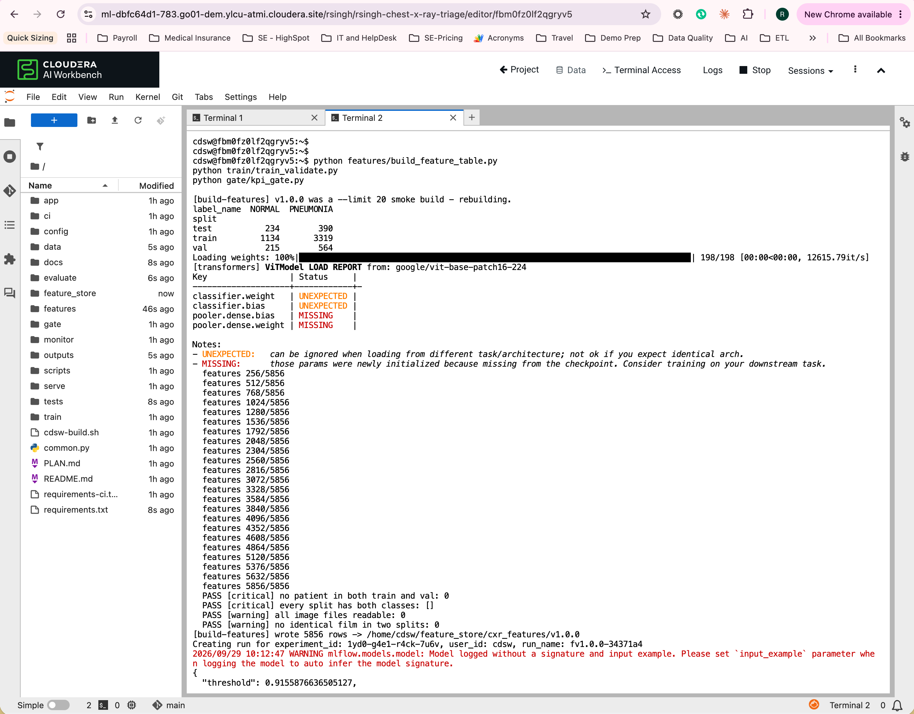

Baseline on this workbench (fv1.0.0, operating threshold 0.916 chosen on VAL):

| Split | AUROC | Sensitivity | Specificity | Brier | FN / FP |
|---|---|---|---|---|---|
| VAL (779) | 0.992 | 0.950 | 0.963 | 0.026 | 28 / 8 |
| TEST (624) | 0.954 | 0.992 | 0.744 | 0.147 | 3 / 60 |

With the placeholder gate (`max_brier: 0.12`) the gate fails on Brier only;
the gate is then set from this baseline (`config/pipeline.yaml`, `gate.*`).
The VAL/TEST gap is the known harder published test split: expect it, and say so.

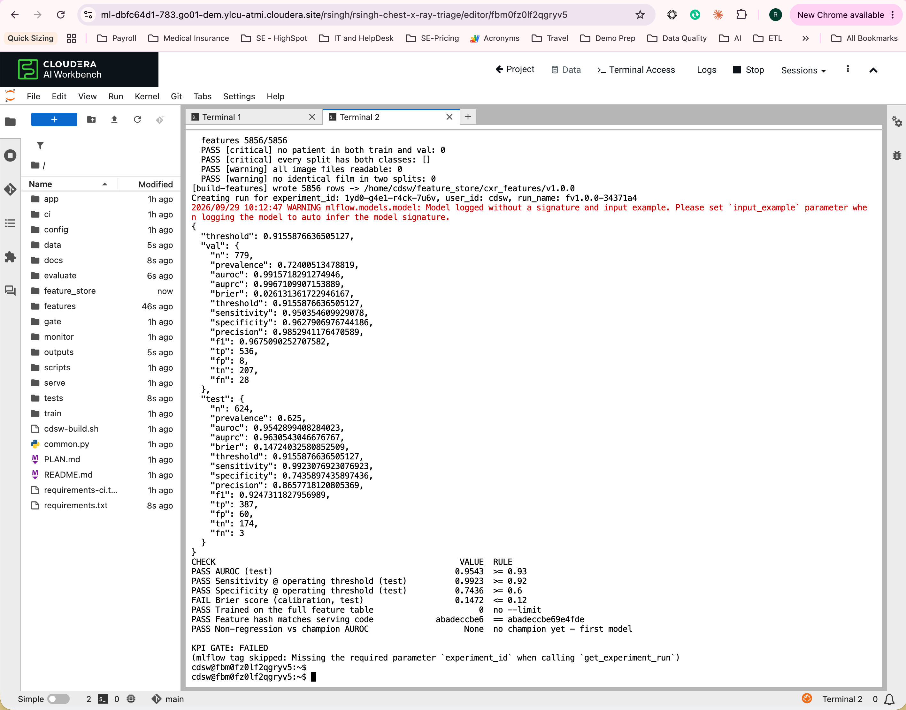

With the gate set from the baseline, the second run skips the feature build
(same hash) and the gate passes:

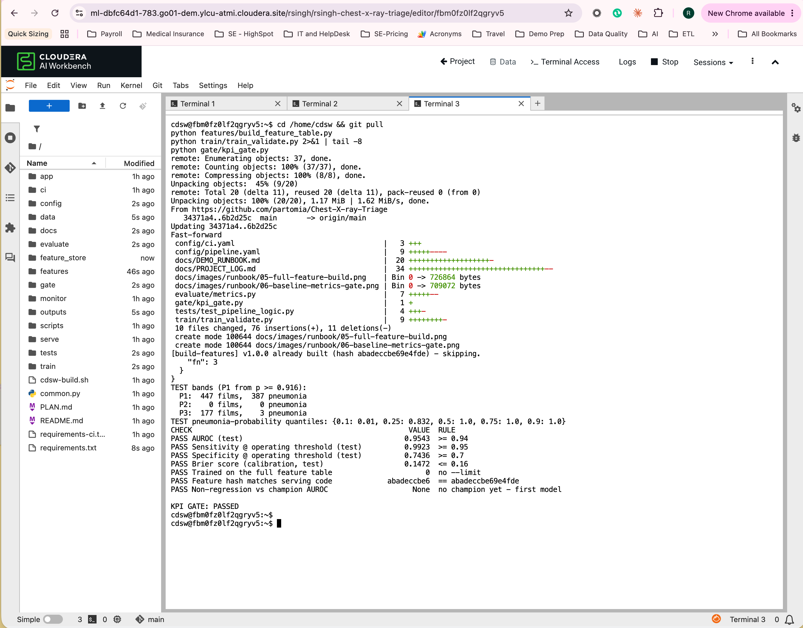

The TEST bands of that model were P1 447 / P2 0 / P3 177: with `C: 0.5` the
probabilities saturate (median 1.0), so P2 is empty. `scripts/band_check.py`
(writes nothing) compares C values and P1 cut-offs on the feature table:

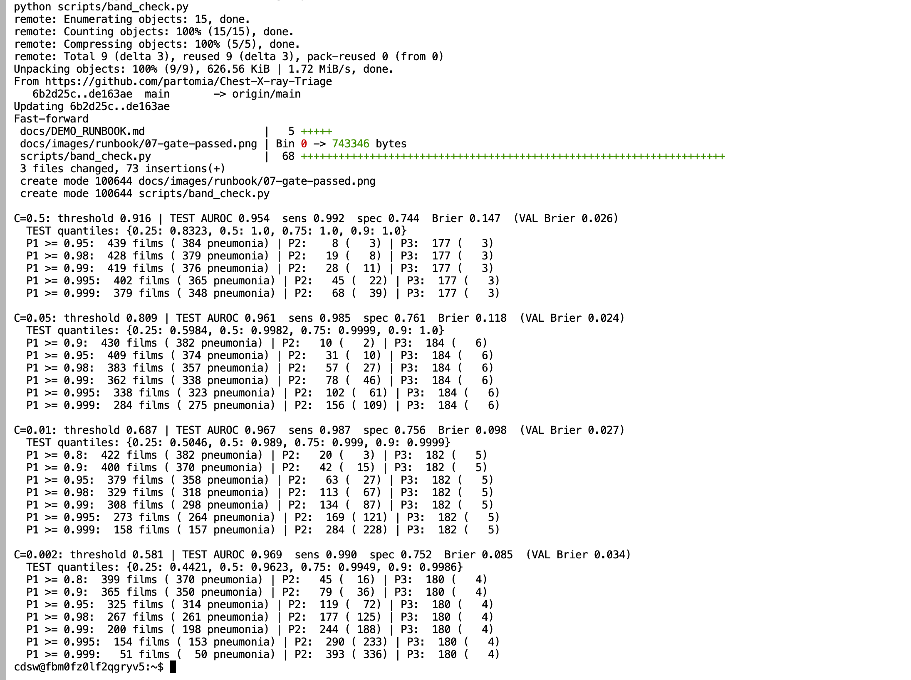

| C | AUROC | Sens | Spec | Brier | P1 (>= 0.99) | P2 | P3 |
|---|---|---|---|---|---|---|---|
| 0.5 | 0.954 | 0.992 | 0.744 | 0.147 | 419 (376 pneumonia) | 28 (11) | 177 (3) |
| 0.05 | 0.961 | 0.985 | 0.761 | 0.118 | 362 (338) | 78 (46) | 184 (6) |
| 0.01 | 0.967 | 0.987 | 0.756 | 0.098 | 308 (298) | 134 (87) | 182 (5) |
| **0.002** | **0.969** | **0.990** | **0.752** | **0.085** | **200 (198)** | **244 (188)** | **180 (4)** |

`C: 0.002` and `p1_probability: 0.99` were chosen: every KPI is better, P1 is
99% pneumonia, P2 is 77%, and P3 misses 4 of 390. The gate was then reset from
this model (AUROC 0.95, sensitivity 0.95, specificity 0.70, Brier 0.12). Be
open about it: C was chosen by looking at TEST (VAL cannot tell the C values
apart: VAL AUROC ~0.99 and Brier 0.024-0.034 for all four), so the TEST numbers
are slightly optimistic. A clean re-run would hold out a second test set.

Open Experiments > `cxr-triage`, read the TEST metrics of the last run and set
each gate threshold a little below the baseline in `config/pipeline.yaml`
(`gate.*`). Commit and push from your laptop, not from the CAI project (job 00
runs `git reset --hard`).

### 1.5 Jobs

```bash
python ci/create_cai_jobs.py --dry-run
python ci/create_cai_jobs.py
```

It creates `cxr-00-sync-code` -> `cxr-01-build-features` -> `cxr-02-train-validate`
-> `cxr-03-kpi-gate` -> `cxr-04-deploy-champion` (each depends on the previous one)
and `cxr-05-nightly-worklist` (cron `0 2 * * *`), using the session's runtime
unless `cai.runtime_identifier` is set, and prints the three GitHub secrets.

Check the runtime in the first line of the dry run: it must be the session's
(`echo $ML_RUNTIME_FULL_VERSION`). The first dry run here picked 2025.09.1-b5
for a 2026.08.1-b5 session because the runtime list is paged; the lookup now
reads every page and warns when there is no exact match.

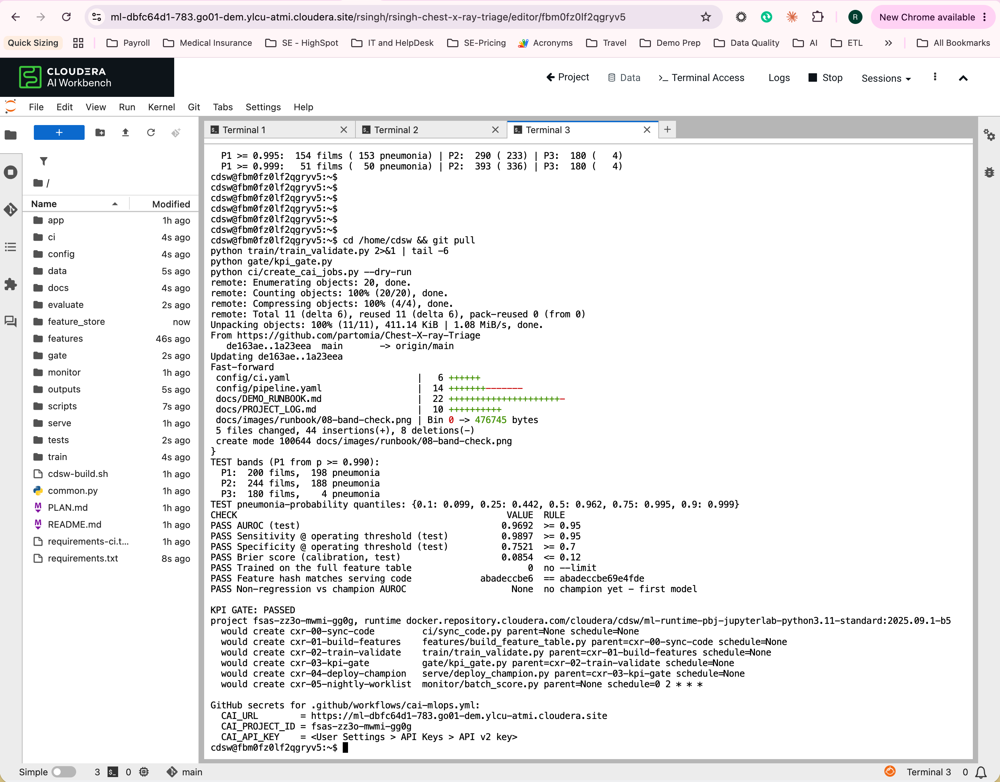

Start `cxr-00-sync-code` from the Jobs page. The chain should end with a
deployed model `cxr-triage` (Model Deployments). Record the run times in
`docs/PROJECT_LOG.md`.

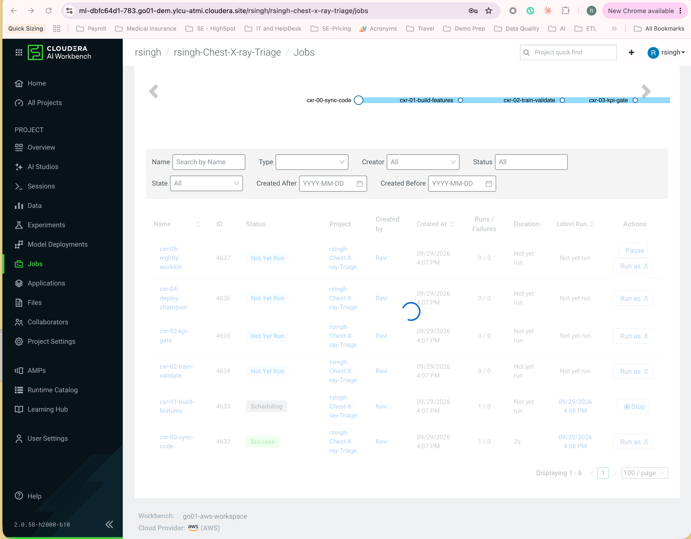

First run on the CDP env: 00 sync 2 s, 01 features 2 s (skipped, same hash),
02 train 1 min 35 s, 03 gate 15 s, 04 deploy 3 min 46 s, about 8 minutes in
total including container start-up.

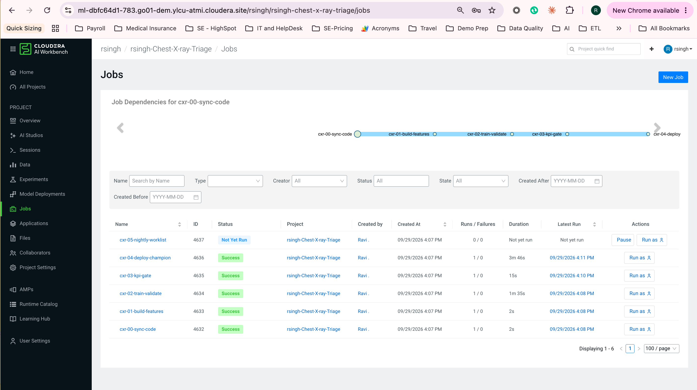

The model `cxr-triage` is deployed as build 1 (2 vCPU / 4 GB, one replica). The
build comment carries the lineage: feature version, git commit and TEST AUROC.

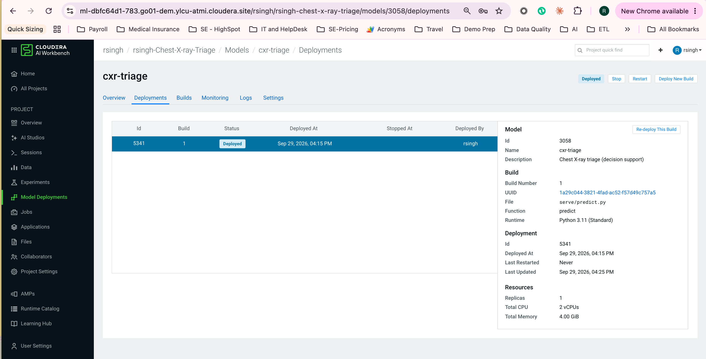

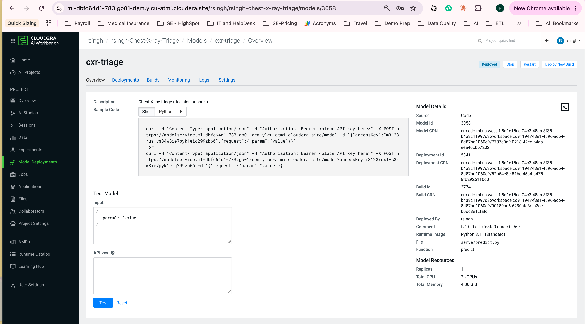

### 1.6 Test the endpoint

```bash
python serve/test_endpoint.py data/incoming/$(ls data/incoming | head -1) --print-request
```

Paste the JSON into the model's Test tab. Expected shape:

```json
{"probability_pneumonia": 0.93, "priority": "P1", "threshold": 0.41,
 "quality_flags": [], "feature_version": "1.0.0", "model_git_sha": "3f2a9c1"}
```

From a terminal: set `CXR_ENDPOINT_URL`, `CXR_ENDPOINT_ACCESS_KEY` and
`CXR_ENDPOINT_API_KEY` (Model API key) and drop `--print-request`. A film is
several hundred KB of base64, so the terminal is easier than the Test tab.
Project variables reach only sessions started after they were saved; in an
older session, `export` them (`read -s` for the API key keeps it off screen).

```bash
for f in $(ls data/incoming | head -3); do echo "== $f"; python serve/test_endpoint.py data/incoming/$f; done
```

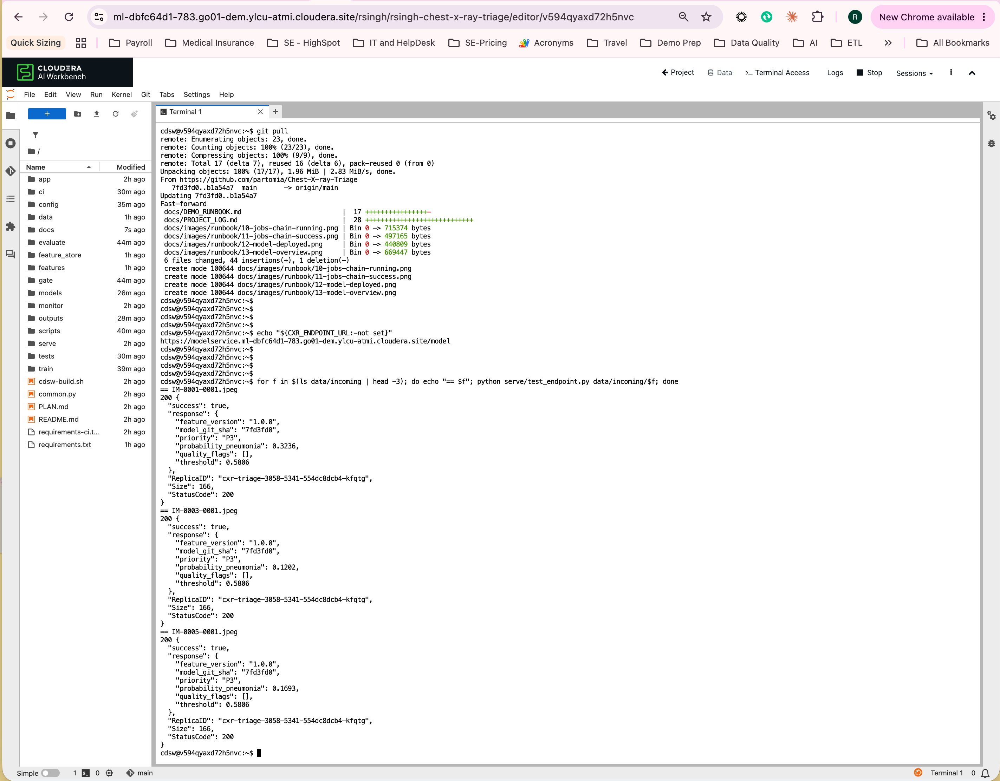

### 1.7 Application

Applications > New Application: name `CXR Triage Worklist`, subdomain
`cxr-triage`, script `app/launch_app.py`, Python 3.11, 2 vCPU / 8 GB.
It is running about a minute later.

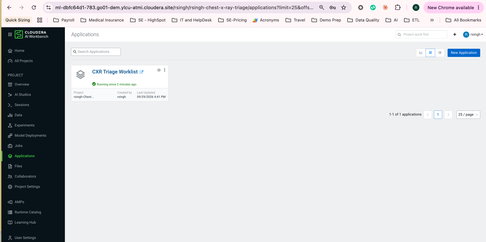

After **Triage worklist** the 40 incoming films (25 pneumonia, 15 normal) band
as P1 15 / P2 11 / P3 14. The occlusion heatmap of a P1 film lights up the lung
fields, not the film edges or markers. A pneumonia film at p = 0.95 lands in P2
(above the 0.581 threshold, below the 0.99 P1 cut-off).

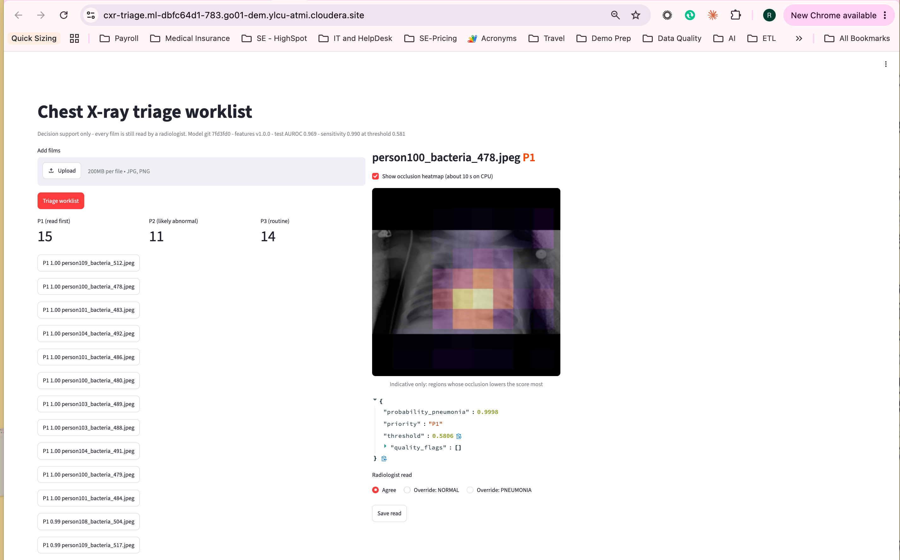

### 1.8 GitHub

1. User Settings > API Keys > create an API v2 key (a service user, ideally).
2. Repo Settings > Secrets and variables > Actions: `CAI_URL`, `CAI_API_KEY`,
   `CAI_PROJECT_ID` (printed by `create_cai_jobs.py`).
3. Optional: Settings > Environments > `cai-demo` > required reviewers, for a
   four-eyes step before the chain starts.
4. The runner must reach `CAI_URL`. Check with `dig +short <workbench host>`: a
   private address (10.x, 172.16-31.x, 192.168.x) is out of reach of
   GitHub-hosted runners (the trigger stops with "Cannot reach ... from this
   runner"). Then register a self-hosted runner inside the network (Settings >
   Actions > Runners > New self-hosted runner, labels `self-hosted,cai`) and set
   the repository variable `CAI_RUNS_ON` to `["self-hosted","cai"]`; no workflow
   edit needed. For a private CA set `CAI_CA_BUNDLE` in that step.
5. Push a harmless change (for example `training.C: 0.002` -> `0.003`) and watch
   the Actions log and the CAI job runs.

Project environment variables are not GitHub secrets: the workflow runs on
GitHub and reads only the repository's secrets. Keep `CAI_*` out of the
workbench project (jobs authenticate with their own identity).

### 1.9 GitHub from the command line (`gh`)

Run on the laptop, logged in with `gh auth login`. `R` saves typing.

```bash
R=partomia/Chest-X-ray-Triage

# Secrets: values from create_cai_jobs.py; the API key is prompted, not echoed
gh secret set CAI_URL        -R $R -b "https://<workbench host>"
gh secret set CAI_PROJECT_ID -R $R -b "<project id>"
gh secret set CAI_API_KEY    -R $R          # paste the API v2 key at the prompt
gh secret list -R $R                        # must list all three names

# Can a GitHub-hosted runner reach the workbench? A 10.x / 172.16-31.x /
# 192.168.x answer means no: use a self-hosted runner (item 4 above)
dig +short <workbench host>
curl -s -o /dev/null -w "%{http_code}\n" https://<workbench host>/api/v2/projects   # 401 = reachable

# Self-hosted runner instead of ubuntu-latest (after registering it with label cai)
gh variable set CAI_RUNS_ON -R $R -b '["self-hosted","cai"]'
gh variable delete CAI_RUNS_ON -R $R        # back to GitHub-hosted runners

# Follow a pipeline run
gh run list -R $R -L 5
gh run watch <run id> -R $R --exit-status
gh run view <run id> -R $R --log | grep cai-pipeline | tail -40
gh run rerun <run id> -R $R                 # e.g. after fixing a secret, no new push needed
gh workflow run cxr-triage-mlops -R $R      # start the chain without a push

# Pause / resume the GitHub -> CAI trigger (the offline CI workflow keeps running)
gh workflow disable cxr-triage-mlops -R $R
gh workflow enable  cxr-triage-mlops -R $R
gh workflow list -R $R --all
```

Status on 2026-09-29: the secrets point at the AWC env, which is on a private
network (10.80.180.97), so the trigger is **disabled** until either a
self-hosted runner is registered there or the secrets are moved to the CDP env
(public address).

## Part 2: seven-minute demo

| Min | Beat | Show |
|---|---|---|
| 0-1 | The problem | App opens on the arrival-order (FIFO) list of 40 films: "which one would you read first?" |
| 1-2 | Triage | Click **Triage worklist**: pneumonia films rise to P1 / P2; the P1 / P2 / P3 counts at the top |
| 2-3 | Trust | Heatmap on a P1 film; a quality flag on a washed-out film; test AUROC and sensitivity in the caption |
| 3-4 | Human in the loop | Override one film, **Save read**: appended to `outputs/feedback/feedback.csv` with the model version |
| 4-6 | MLOps | Push a config change -> Actions starts the CAI chain -> Experiments shows the new run -> gate PASS -> new model build |
| 6-7 | Platform | Images never left the workbench; the same pattern on-prem or air-gapped; no CDW / CDE for AI-only accounts |

Say it plainly: pediatric, single-source dataset; decision support, not
diagnosis; the heatmap is indicative (48-pixel patches), not lesion localisation.

### Lakehouse extension (federal environment, +5 minutes)

| Min | Beat | Show |
|---|---|---|
| 7-8 | The hospital day | CDE Airflow UI: DAG `cxr_triage_lakehouse`, one run per business date: land, bronze, silver, gold, `cai_score_studies`, outcomes |
| 8-9 | CAI inside the pipeline | CAI Jobs: `cxr-06-score-studies` started by Airflow with `CXR_BUSINESS_DATE`; Hue: `ref.triage_run` shows the gold snapshot it read |
| 9-10 | The benefit | Dashboard *CXR Triage Operations*: pneumonia median wait FIFO ~3 h vs triage under 1 h; the worklist in triage order; normal films wait longer (the cost) |
| 10-11 | Trust in the data | *CXR Model, Drift & Data Quality* / Data quality: 2026-10-01's quarantined order and PACS header, the two re-sent headers EXPLAINED, zero mismatches |
| 11-12 | Trust in the model | Same dashboard / Model: gate decision and deployment rows written by jobs 03 / 04, PSI per scored day |

Setup and re-run commands: README, section *Lakehouse*. Trigger one date by hand:
`cde job run --name rsingh-cxr-orchestration --config-json '{"business_date": "2026-10-06"}'`.
The DAG is paused on creation; `cde job update --name rsingh-cxr-orchestration --schedule-enabled=true`
(or unpause in the Airflow UI) starts the daily 01:30 UTC schedule.

## Part 3: failure path, VERIFY, troubleshooting

### Rehearse the gate rejecting

Push `gate.min_specificity: 0.99`. The chain stops at `cxr-03-kpi-gate`, the
endpoint keeps serving the old champion, GitHub shows
`KPI GATE REJECTED the candidate`. Revert the change.

### Rollback by hand

Every previous champion is in `models/archive/<timestamp>/`, with its own
passing `gate_result.json`. Make it the candidate and re-run only the deploy job:

```bash
rm -rf outputs/candidate && cp -r models/archive/<timestamp> outputs/candidate
```

Then start `cxr-04-deploy-champion` from the Jobs page: it archives the current
champion, promotes the old one and rebuilds the endpoint.

### VERIFY on the target workbench (one-time)

| Item | Where | What to confirm |
|---|---|---|
| Model build / deployment status strings | `serve/deploy_champion.py` `wait()` | confirmed on the CDP env 2026-09-29: job 04 built and deployed the model |
| Runtime detection | `ci/cai_jobs.py` `resolve_runtime()` | `ML_RUNTIME_KERNEL/EDITION/EDITOR` exist in the session, else set `cai.runtime_identifier` |
| Build-time install | `cdsw-build.sh` | model builds run it on this runtime |
| Job-run list | `ci/trigger_cai_pipeline.py` | `sort=-created_at`, `page_size`, `job_runs` key (documented; confirm once) |
| Registry | `cai.register_in_model_registry` | only if the AI Registry is configured |
| Dataset licence | Kaggle / Mendeley listing | CC BY 4.0 attribution text |

Already confirmed on the live workbench by the sibling projects: job-run status
values (`ENGINE_SUCCEEDED`, `..._FAILED`, `..._TIMEDOUT`), `environment` applied
on a job run (`arguments` ignored), the `-f` argument and missing `__file__`
in job kernels, `sys.exit(0)` reported as a failure, the Streamlit launcher.

### Troubleshooting

| Symptom | Cause and fix |
|---|---|
| Job 01: `exists with hash ... Bump features.version` | the feature definition changed; bump `features.version` so the old table stays for the champion |
| Job 01: critical data check failed | patient leakage or an empty split/class; check `data/raw` (nested copy from the zip?) |
| Job 02: `feature table hash != code hash` | same as above; rebuild under a new version |
| Endpoint fails to start: `different feature definition` | champion trained on other features; run the chain again |
| Train: `mlflow logging failed ... unexpected keyword argument 'run_uuid'` | a newer mlflow was pip-installed over the runtime's one, which breaks `mlflow-cml-plugin`. `requirements.txt` no longer lists mlflow; remove the user copy: `pip3 uninstall -y mlflow mlflow-skinny mlflow-tracing` (only `~/.local` is touched), then check `python -c "import mlflow; print(mlflow.__file__)"` points at `/usr/local` |
| `AutoImageProcessor requires the Torchvision library` | `pip3 install -r requirements.txt` (torchvision is listed) |
| Chain stops at 00: `Expected commit ... newer push?` | a newer push is queued; its own chain runs next |
| GitHub: `CAI jobs not found` | run `python ci/create_cai_jobs.py`; names must match `ci/cai_jobs.py` |
| Job 04: `deploy failed: (500) ... deploy-model: context deadline exceeded` | the API gateway gave up after 30 s while the workbench kept deploying; job 04 now finds that deployment and waits for it. With an older copy of the code, check Model Deployments (it usually reaches Deployed) and re-run the chain from cxr-00 so `models/champion/` matches the endpoint |
| Job run `timedout` | raise the job's timeout (`ci/cai_jobs.py`, then edit the job) or check GPU / node availability |
