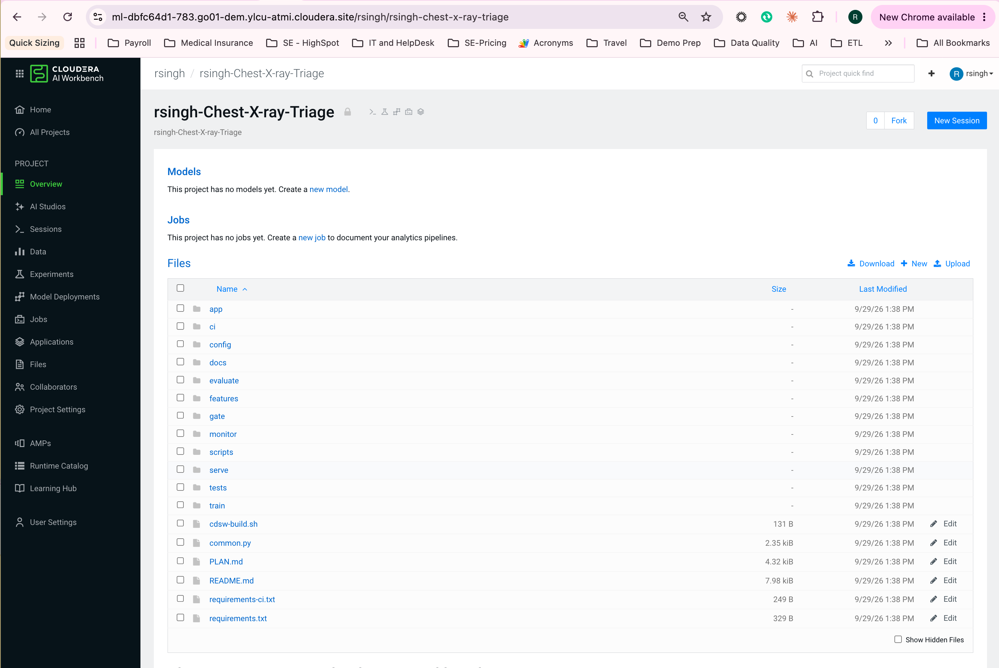
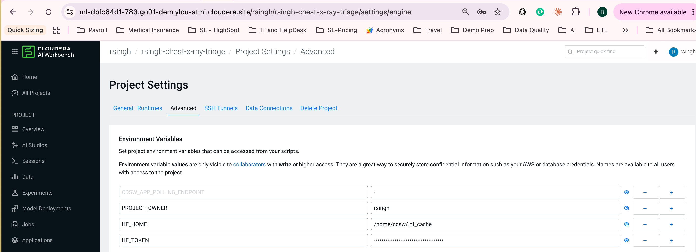
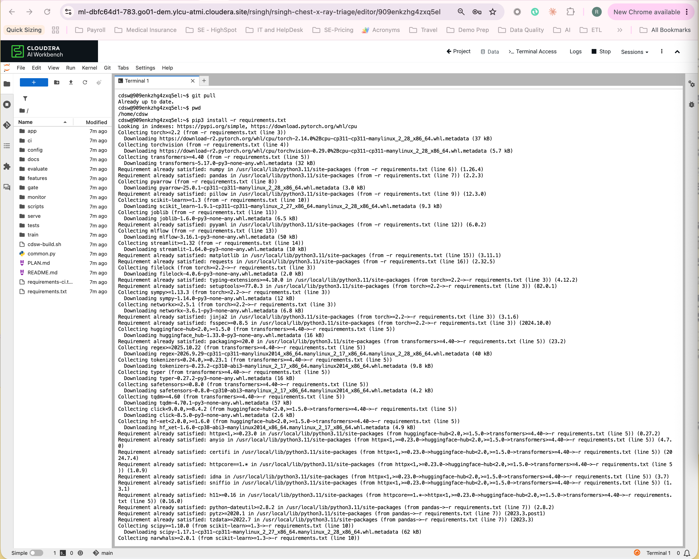
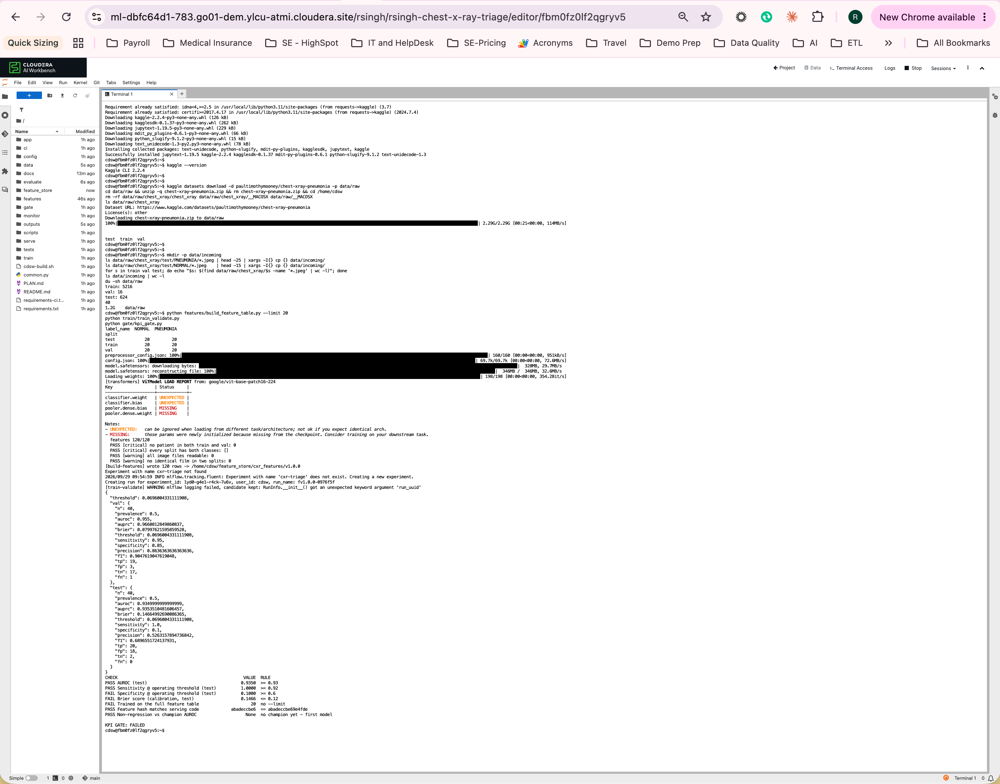

# Demo runbook: Chest X-ray Triage on Cloudera AI

Part 1 is the one-time setup, copy-paste, in order. Part 2 is the seven-minute
demo. Part 3 is the failure-path rehearsal, the VERIFY list and troubleshooting.

## Part 1: setup (one-time)

### 1.1 Prerequisites

| Need | Detail |
|---|---|
| Workbench | Cloudera AI Workbench with Jobs, Models, Applications and Experiments; AI Registry optional |
| Runtime | JupyterLab, Python 3.11, Standard edition. GPU optional (feature build only) |
| Resources | 4 vCPU / 16 GB for the feature build; ~8 GB project storage |
| Outbound | pypi.org, download.pytorch.org, huggingface.co (or internal mirrors), github.com, kaggle.com |
| Accounts | GitHub repo `partomia/Chest-X-ray-Triage`; a Kaggle account for the dataset |

### 1.2 Project, packages, environment

1. Projects > New Project > Git: `https://github.com/partomia/Chest-X-ray-Triage`
   (SSH URL for a private repo, after adding the CAI user's SSH key as a
   read-only deploy key). Runtime: JupyterLab, Python 3.11, Standard.

   

2. Project Settings > Advanced > Environment variables:

   | Variable | Value |
   |---|---|
   | `HF_HOME` | `/home/cdsw/.hf_cache` |
   | `HF_TOKEN` | optional: a Hugging Face read token, avoids rate limits on the ViT download |
   | `HF_ENDPOINT` | only for an internal Hugging Face mirror |

   

3. Open a session (4 vCPU / 16 GB) and install:

   ```bash
   pip3 install -r requirements.txt
   ```

   torch and torchvision come from the CPU wheel index (`download.pytorch.org/whl/cpu`).
   A yellow "dependency resolver" warning at the end is harmless; only an `ERROR:` line matters.

   

### 1.3 Data

Kaggle now issues API tokens (`KGAT_...`) instead of a `kaggle.json` download;
the Kaggle CLI 1.8+ reads them from `KAGGLE_API_TOKEN`. Revoke the token once
the download is done.

```bash
pip3 install -U kaggle         # 2.x; needs >= 1.8 for KGAT_ tokens
export KAGGLE_API_TOKEN=<token from kaggle.com > Settings > API>
kaggle datasets download -d paultimothymooney/chest-xray-pneumonia -p data/raw
cd data/raw && unzip -q chest-xray-pneumonia.zip && rm chest-xray-pneumonia.zip && cd /home/cdsw
rm -rf data/raw/chest_xray/chest_xray data/raw/chest_xray/__MACOSX data/raw/__MACOSX   # nested copy in the zip
ls data/raw/chest_xray          # must be train  val  test
mkdir -p data/incoming
ls data/raw/chest_xray/test/PNEUMONIA/*.jpeg | head -25 | xargs -I{} cp {} data/incoming/
ls data/raw/chest_xray/test/NORMAL/*.jpeg    | head -15 | xargs -I{} cp {} data/incoming/
for s in train val test; do echo "$s: $(find data/raw/chest_xray/$s -name '*.jpeg' | wc -l)"; done
unset KAGGLE_API_TOKEN
```

The zip is 2.29 GB (it holds a second, nested copy); after the clean-up
`data/raw` is 1.2 GB. Expect 5,216 train, 16 val and 624 test films (5,856 in
total) and 40 in `data/incoming`. Kaggle lists the licence as "other": check the
attribution (Mendeley release, CC BY 4.0) before showing it to a customer.

### 1.4 Smoke test, then baseline

```bash
python features/build_feature_table.py --limit 20     # ~1 min incl. the ViT download
python train/train_validate.py
python gate/kpi_gate.py                               # FAILS by design: trained on a --limit table
```

The smoke table has 120 rows (20 films per class per split) and all data checks
pass. The ViT load report lists `pooler.*` as MISSING and `classifier.*` as
UNEXPECTED: harmless, the embedding is the CLS token of `last_hidden_state` and
never uses the pooler. On 40 TEST films the gate fails on
`Trained on the full feature table` (and on specificity and Brier, which are
noise at this size): the expected result.



Then the full baseline:

```bash
python features/build_feature_table.py                # full build (rebuilds the smoke table), ~10-20 min on CPU
python train/train_validate.py
python gate/kpi_gate.py
```

Open Experiments > `cxr-triage`, read the TEST metrics of the last run and set
each gate threshold a little below the baseline in `config/pipeline.yaml`
(`gate.*`). Commit and push from your laptop, not from the CAI project (job 00
runs `git reset --hard`).

### 1.5 Jobs

```bash
python ci/create_cai_jobs.py --dry-run
python ci/create_cai_jobs.py
```

It creates `cxr-00-sync-code` -> `cxr-01-build-features` -> `cxr-02-train-validate`
-> `cxr-03-kpi-gate` -> `cxr-04-deploy-champion` (each depends on the previous one)
and `cxr-05-nightly-worklist` (cron `0 2 * * *`), using the session's runtime
unless `cai.runtime_identifier` is set, and prints the three GitHub secrets.

Start `cxr-00-sync-code` from the Jobs page. The chain should end with a
deployed model `cxr-triage` (Model Deployments). Record the run times in
`docs/PROJECT_LOG.md`.

### 1.6 Test the endpoint

```bash
python serve/test_endpoint.py data/incoming/$(ls data/incoming | head -1) --print-request
```

Paste the JSON into the model's Test tab. Expected shape:

```json
{"probability_pneumonia": 0.93, "priority": "P1", "threshold": 0.41,
 "quality_flags": [], "feature_version": "1.0.0", "model_git_sha": "3f2a9c1"}
```

From a terminal: set `CXR_ENDPOINT_URL`, `CXR_ENDPOINT_ACCESS_KEY` and
`CXR_ENDPOINT_API_KEY` (Model API key) and drop `--print-request`.

### 1.7 Application

Applications > New Application: name `CXR Triage Worklist`, subdomain
`cxr-triage`, script `app/launch_app.py`, Python 3.11, 2 vCPU / 8 GB.

### 1.8 GitHub

1. User Settings > API Keys > create an API v2 key (a service user, ideally).
2. Repo Settings > Secrets and variables > Actions: `CAI_URL`, `CAI_API_KEY`,
   `CAI_PROJECT_ID` (printed by `create_cai_jobs.py`).
3. Optional: Settings > Environments > `cai-demo` > required reviewers, for a
   four-eyes step before the chain starts.
4. Private Cloud / no public ingress: register a self-hosted runner inside the
   network and change `runs-on` to `[self-hosted, cai]` in `cai-mlops.yml`;
   for a private CA set `CAI_CA_BUNDLE` in that step.
5. Push a harmless change (for example `training.C: 0.5` -> `1.0`) and watch
   the Actions log and the CAI job runs.

## Part 2: seven-minute demo

| Min | Beat | Show |
|---|---|---|
| 0-1 | The problem | App opens on the arrival-order (FIFO) list of 40 films: "which one would you read first?" |
| 1-2 | Triage | Click **Triage worklist**: pneumonia films rise to P1 / P2; the P1 / P2 / P3 counts at the top |
| 2-3 | Trust | Heatmap on a P1 film; a quality flag on a washed-out film; test AUROC and sensitivity in the caption |
| 3-4 | Human in the loop | Override one film, **Save read**: appended to `outputs/feedback/feedback.csv` with the model version |
| 4-6 | MLOps | Push a config change -> Actions starts the CAI chain -> Experiments shows the new run -> gate PASS -> new model build |
| 6-7 | Platform | Images never left the workbench; the same pattern on-prem or air-gapped; no CDW / CDE for AI-only accounts |

Say it plainly: pediatric, single-source dataset; decision support, not
diagnosis; the heatmap is indicative (48-pixel patches), not lesion localisation.

## Part 3: failure path, VERIFY, troubleshooting

### Rehearse the gate rejecting

Push `gate.min_specificity: 0.99`. The chain stops at `cxr-03-kpi-gate`, the
endpoint keeps serving the old champion, GitHub shows
`KPI GATE REJECTED the candidate`. Revert the change.

### Rollback by hand

Every previous champion is in `models/archive/<timestamp>/`, with its own
passing `gate_result.json`. Make it the candidate and re-run only the deploy job:

```bash
rm -rf outputs/candidate && cp -r models/archive/<timestamp> outputs/candidate
```

Then start `cxr-04-deploy-champion` from the Jobs page: it archives the current
champion, promotes the old one and rebuilds the endpoint.

### VERIFY on the target workbench (one-time)

| Item | Where | What to confirm |
|---|---|---|
| Model build / deployment status strings | `serve/deploy_champion.py` `wait()` | build reaches `built` (or `succeeded`), deployment `deployed` |
| Runtime detection | `ci/cai_jobs.py` `resolve_runtime()` | `ML_RUNTIME_KERNEL/EDITION/EDITOR` exist in the session, else set `cai.runtime_identifier` |
| Build-time install | `cdsw-build.sh` | model builds run it on this runtime |
| Job-run list | `ci/trigger_cai_pipeline.py` | `sort=-created_at`, `page_size`, `job_runs` key (documented; confirm once) |
| Registry | `cai.register_in_model_registry` | only if the AI Registry is configured |
| Dataset licence | Kaggle / Mendeley listing | CC BY 4.0 attribution text |

Already confirmed on the live workbench by the sibling projects: job-run status
values (`ENGINE_SUCCEEDED`, `..._FAILED`, `..._TIMEDOUT`), `environment` applied
on a job run (`arguments` ignored), the `-f` argument and missing `__file__`
in job kernels, `sys.exit(0)` reported as a failure, the Streamlit launcher.

### Troubleshooting

| Symptom | Cause and fix |
|---|---|
| Job 01: `exists with hash ... Bump features.version` | the feature definition changed; bump `features.version` so the old table stays for the champion |
| Job 01: critical data check failed | patient leakage or an empty split/class; check `data/raw` (nested copy from the zip?) |
| Job 02: `feature table hash != code hash` | same as above; rebuild under a new version |
| Endpoint fails to start: `different feature definition` | champion trained on other features; run the chain again |
| Train: `mlflow logging failed ... unexpected keyword argument 'run_uuid'` | a newer mlflow was pip-installed over the runtime's one, which breaks `mlflow-cml-plugin`. `requirements.txt` no longer lists mlflow; remove the user copy: `pip3 uninstall -y mlflow mlflow-skinny mlflow-tracing` (only `~/.local` is touched), then check `python -c "import mlflow; print(mlflow.__file__)"` points at `/usr/local` |
| `AutoImageProcessor requires the Torchvision library` | `pip3 install -r requirements.txt` (torchvision is listed) |
| Chain stops at 00: `Expected commit ... newer push?` | a newer push is queued; its own chain runs next |
| GitHub: `CAI jobs not found` | run `python ci/create_cai_jobs.py`; names must match `ci/cai_jobs.py` |
| Job run `timedout` | raise the job's timeout (`ci/cai_jobs.py`, then edit the job) or check GPU / node availability |
